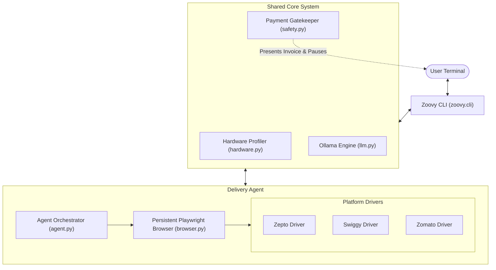

# 🚀 Zoovy: Autonomous Local AI Agent Hub

[](LICENSE)
[](https://python.org)
[](https://ollama.com)
[](https://playwright.dev)

**Zoovy** is an open-source, fully local AI agent framework designed to automate real-world daily tasks. Its flagship module, **`delivery-agent`**, autonomously navigates delivery platforms (**Zepto**, **Swiggy**, and **Zomato**), searches products, builds carts, resolves item variants, and navigates to the checkout counter—with a built-in **Human-in-the-Loop (HITL) payment firewall**.

---

## 🌟 Key Features

- 🧠 **100% Local Intelligence:** Powered by local open-weights LLMs via [Ollama](https://ollama.com) (no API keys, no subscription fees, complete privacy).
- ⚡ **Dynamic Hardware Detection:** Automatically profiles your GPU, VRAM, and RAM on startup and recommends the optimal model tier.
- 🛒 **Multi-Platform Delivery Support:**
  - **Zepto:** Quick commerce groceries & fresh essentials
  - **Swiggy:** Food delivery & Instamart
  - **Zomato:** Restaurant discovery & food ordering
- 🔑 **Persistent Sessions:** Log in once with your phone number and OTP; session cookies are securely persisted locally.
- 🛡️ **Human-in-the-Loop Payment Guardrail:** The AI handles product discovery, price comparisons, and cart building, but **never** triggers payment. It pauses at checkout, presents an order invoice summary, and asks for your physical confirmation.
- 🧩 **Extensible Agent Architecture:** Designed as an umbrella hub so new agents (travel, finances, calendar) can plug into the shared core.

---

## 📊 VRAM Tier & Model Recommendation Benchmark

Zoovy evaluates local models using the **Berkeley Function Calling Leaderboard (BFCL v4)** to ensure reliable tool-calling and zero hallucination.

| Hardware Tier | Available VRAM | Recommended Model | BFCL v4 Score | Quantization | Tokens/sec | Target Systems |
| :--- | :--- | :--- | :--- | :--- | :--- | :--- |
| **Tier 1: Enthusiast** | **>= 16 GB** | **`qwen2.5:14b`** | **88.4%** | Q4_K_M (~9.2GB) | ~48 t/s | AMD RX 9070 XT, RTX 4080/4090, Apple M3/M4 Max |
| **Tier 2: Standard** | **8 GB – 15 GB** | **`qwen2.5:7b`** | **83.1%** | Q4_K_M (~5.2GB) | ~85 t/s | RTX 3060/4060/4070, Apple M-series 16GB |
| **Tier 3: Entry** | **4 GB – 7 GB** | **`qwen2.5:3b`** | **71.2%** | Q4_K_M (~2.6GB) | ~130 t/s | Budget laptops, GTX 1660, Steam Deck |
| **Tier 4: CPU Fallback** | **CPU Only** | **`qwen2.5:3b` / `1.5b`** | **64.0%** | Q4_K_M | ~15-25 t/s | Systems without dedicated GPU |

> **Why Qwen 2.5?** In real-world benchmarks, Qwen 2.5 significantly outperforms Llama 3.1 on Indian grocery taxonomy (e.g., *Amul butter*, *paneer*, *atta*, regional vegetable names) and strict JSON schema adherence.

---

## 🛠️ Installation & Quickstart

### 1. Prerequisites
- **Python 3.10+**
- **Git**
- **Ollama:** [Download & Install Ollama](https://ollama.com/download)

### 2. Clone & Install
```bash
git clone https://github.com/akusa-03/zoovy.git
cd zoovy

# Create virtual environment
python -m venv .venv
# On Windows:
.venv\Scripts\activate
# On Linux/macOS:
source .venv/bin/activate

# Install dependencies
pip install -e .
playwright install chromium
```

### 3. Run Hardware Diagnostic & Setup
```bash
# Check system readiness and get your hardware tier recommendation
zoovy doctor

# Automatically detect VRAM and pull the optimal model from Ollama
zoovy setup
```

### 4. Place an Autonomous Order
```bash
# Order groceries on Zepto
zoovy order --platform zepto "Get 500g Amul salted butter and 1kg tomatoes"

# Order food on Swiggy
zoovy order --platform swiggy "Order 2 chicken biryanis from the highest rated restaurant nearby"
```

---

## 🏗️ System Architecture



---

## 🛡️ Safety & Payment Guardrails

Autonomous agents should **never** have uncontrolled access to financial accounts. Zoovy implements strict deterministic guardrails:
1. **No Stored Payment Credentials:** Zoovy never asks for or stores UPI PINs, CVVs, or card credentials.
2. **Deterministic Checkout Breakpoint:** Navigation strictly halts at the final checkout view.
3. **Interactive Terminal Invoice:** Zoovy prints the cart breakdown (item count, total INR, delivery fees) and opens the visible browser window for the human user to complete payment.

---

## 🗺️ Roadmap & Future Modules

- [ ] **Voice Control:** Local Whisper speech-to-text input.
- [ ] **Visual UI Fallback:** `qwen2.5-vl:7b` vision engine for complex canvas/SVG UI components.
- [ ] **Travel Agent:** Local flight & train price tracking and reservation assistant.
- [ ] **Android Device Bridge:** Optional ADB bridge for mobile-app-only platforms.

---

## 📄 License

Distributed under the MIT License. See `LICENSE` for more information.
