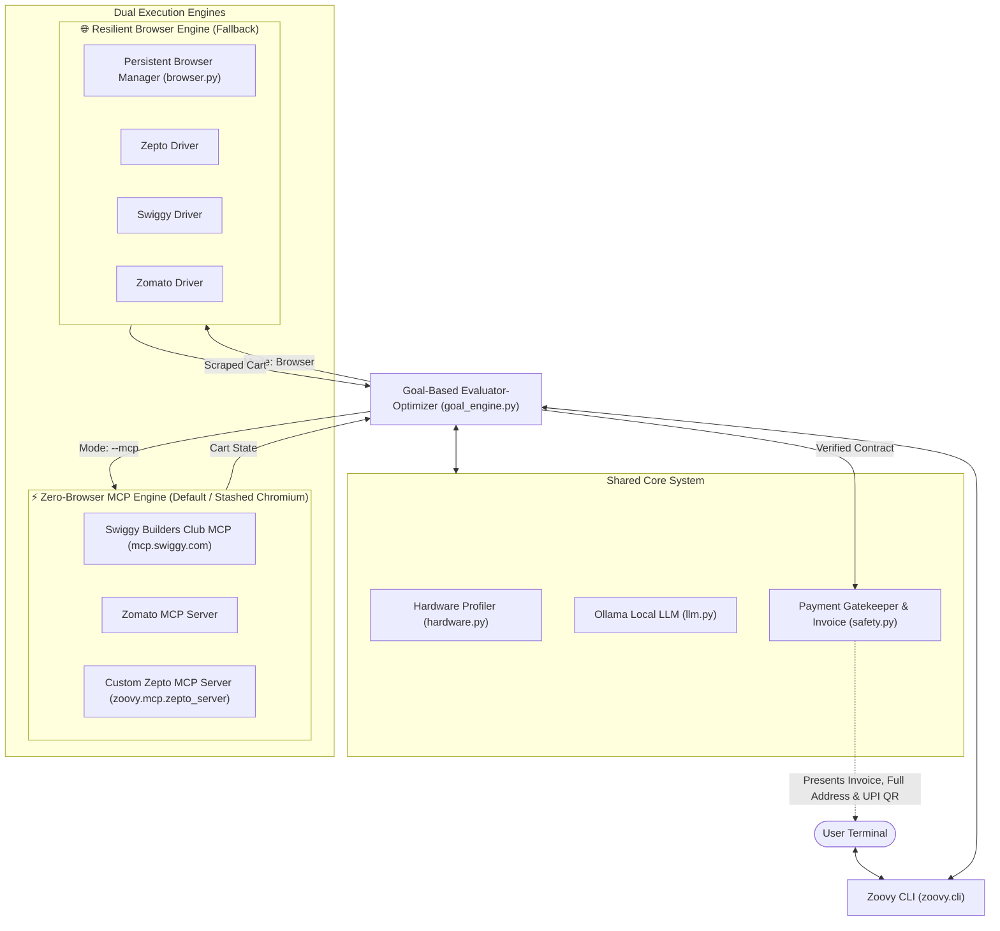

# 🚀 Zoovy: Autonomous Local AI Agent Hub

[](LICENSE)
[](https://python.org)
[](https://ollama.com)
[](https://modelcontextprotocol.io)
[-red.svg)](https://playwright.dev)
[](CHANGELOG.md)

**Zoovy** is an open-source, fully local autonomous AI agent ecosystem designed to automate real-world commerce and delivery tasks (**Swiggy**, **Zomato**, and **Zepto**).

Zoovy features a **Dual-Engine Architecture**:
1. **⚡ Official MCP Engine (Zero-Browser API - Stashing Chromium):** Connects directly to **Swiggy Builders Club** (`mcp.swiggy.com`), **Zomato MCP**, and our standalone **Zepto MCP Server** over standardized JSON-RPC tools. No browser windows pop up, operations take sub-seconds, and payments are generated as native UPI QR codes.
2. **🌐 Resilient Browser Engine (Fallback):** Persistent Chromium automation with anti-detection and cookie persistence when direct MCP accounts are unconfigured.

All orders are governed by a **Goal-Based Evaluator-Optimizer Engine** (Reflexion loop) and a strict **Human-in-the-Loop (HITL) Payment Firewall**.

---

## 🌟 Key Features

- 🧠 **100% Local Intelligence:** Powered by local open-weights LLMs via [Ollama](https://ollama.com) (zero API costs, complete privacy, runs on your GPU).
- ⚡ **Official Model Context Protocol (MCP) Integration:**
  - **Swiggy:** 49 native tools across Food delivery, Instamart groceries (40,000+ SKUs), and Dineout table reservations.
  - **Zomato:** Zero-browser restaurant menus, item customization, and instant UPI QR payments.
  - **Zepto:** Standalone custom MCP server (`zoovy.mcp.zepto_server`) built on the official MCP 2.x standard.
- 🎯 **Goal-Oriented Evaluator-Optimizer Loop:** Deconstructs prompts into formal **Acceptance Criteria** and **Negative Constraints**, evaluates live cart state, and executes self-correcting reflexion cycles before showing the invoice.
- 📍 **Full Address Verification:** Shows the full, unabridged delivery destination (house/flat number, building, street, landmark, and pincode) before authorization.
- 🛒 **Interactive Cart Modification:** Edit your cart live (`[m] Modify`) and press Enter to have Zoovy re-inspect items and recalculate totals automatically.
- 🛡️ **Human-in-the-Loop Payment Firewall:** AI prepares the cart, resolves variants, and verifies totals, but **never** auto-debits funds. Payment requires your manual confirmation.

---

## 🏗️ System Architecture



---

## 📊 VRAM Tier & Model Recommendation

Zoovy defaults out-of-the-box to **`qwen2.5:1.5b`** (~986MB, fast, universal compatibility), with hardware-matched enhanced tiers available during setup:

| Model Role | Model Tag | Required VRAM | BFCL v4 Score | Download Size | Best Suited For |
| :--- | :--- | :--- | :--- | :--- | :--- |
| **Default Out-of-the-Box** | **`qwen2.5:1.5b`** | **~1.5 GB** | **64.0%** | **~986 MB** | Instant setup, universal compatibility, CPUs, laptops |
| **Tier 1: Enhanced** | **`qwen2.5:14b`** | **~9.2 GB** | **88.4%** | **~9.0 GB** | Enthusiast GPUs (>= 16GB VRAM: AMD RX 9070 XT, RTX 4080/4090) |
| **Tier 2: Enhanced** | **`qwen2.5:7b`** | **~5.2 GB** | **83.1%** | **~4.7 GB** | Standard GPUs (8GB - 15GB VRAM: RTX 3060/4060/4070) |
| **Tier 3: Enhanced** | **`qwen2.5:3b`** | **~2.6 GB** | **71.2%** | **~2.0 GB** | Entry-level GPUs (4GB - 7GB VRAM) |

---

## 🛠️ Installation & Quickstart

### 1. Prerequisites
- **Python 3.10+**
- **Git**
- **Ollama:** [Download & Install Ollama](https://ollama.com/download)

### 2. Clone the Repository
```bash
git clone https://github.com/akusa-03/zoovy.git
cd zoovy
```

### 3. Automated 1-Click Setup
- **Windows (PowerShell):**
  ```powershell
  .\setup.ps1
  ```
  *(Or double-click `setup.bat`)*
- **Linux / macOS:**
  ```bash
  chmod +x setup.sh && ./setup.sh
  ```

### 4. Run Hardware Diagnostic
```bash
zoovy doctor
zoovy setup
```

---

## 🚀 Usage Guide

### A. Zero-Browser Mode via Official MCP (Recommended)
Stashes Chromium entirely. Operates over fast JSON-RPC tools and returns native UPI QR payment links:
```bash
# Order groceries on Swiggy Instamart via MCP
zoovy order "Get 4 cans of diet coke" --platform swiggy --mcp

# Order food on Zomato via MCP
zoovy order "Order 2 chicken biryanis" --platform zomato --mcp
```

### B. Interactive Platform Prompt
If you don't mention a platform in your prompt, Zoovy interactively asks before running:
```bash
zoovy order "Get 4 cans of diet coke to my home"
```
```text
📍 Platform Selection:
No delivery platform was specified in your prompt.
  [1] Swiggy (Instamart Groceries & Food - Official MCP)
  [2] Zepto (Quick-Commerce)
  [3] Zomato (Food Delivery)

Select platform [1-3, Default: 1 (Swiggy)]:
```

### C. Standalone Zepto MCP Server
Run our built-in custom Zepto MCP server for Claude Desktop, Cursor, or Zoovy:
```powershell
python -m zoovy.mcp.zepto_server
```
*Exposes `zepto_search_products`, `zepto_add_to_cart`, `zepto_get_cart`, `zepto_get_saved_addresses`, and `zepto_checkout` over standard I/O (stdio).*

### D. Interactive Cart Modification Loop
Whenever Zoovy displays the invoice table, you can interactively inspect or change your items:
```text
Order Actions:
  [y] Confirm & proceed to payment
  [m] Modify cart in browser (add/remove items or adjust quantities)
  [n] Abort order

Select action [y/m/N]:
```
Pressing **`m`** pauses the agent, allows you to adjust items live, and re-calculates the entire invoice upon pressing Enter.

---

## 🛡️ Safety & Payment Guardrails

1. **Zero Financial Auto-Debit:** Zoovy never asks for or stores UPI PINs, CVVs, or card credentials.
2. **Verified Destination Display:** The complete address (flat, building, street, landmark, pincode) is printed before payment.
3. **Deterministic Payment Pause:** Navigation halts at payment; an interactive invoice and payment QR are displayed for human authorization.

---

## 📄 License

Distributed under the MIT License. See `LICENSE` for details.\n